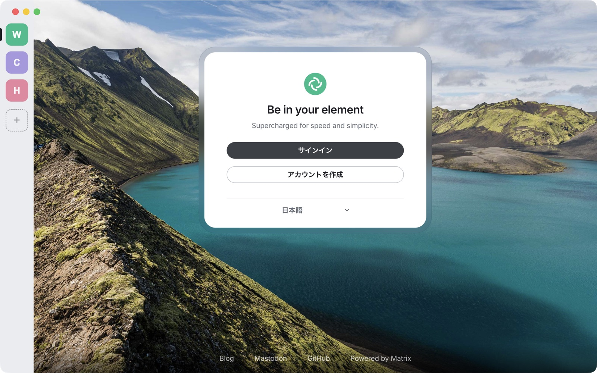

# mxdeck

English | [日本語](README.ja.md)

A macOS desktop shell that keeps several Matrix accounts in one window.
Pick an account in the left sidebar and its Matrix web client (Element Web, Cinny, …) appears on the right.



Element Desktop runs one account per process; the only way to use several is to start separate
processes with `--profile`. Making Element Web itself multi-account is a deep change (`MatrixClientPeg`
and friends are singletons), so mxdeck does it from the outside: one isolated browser environment per account.

> mxdeck is a personal project and is not affiliated with Element (New Vector Ltd) or The Matrix.org Foundation.

## Features

- Cookies, localStorage, IndexedDB (including the crypto store) and service workers are isolated per account
- Loads hosted web clients as they are — a self-hosted Element Web keeps its own config, theme and modules
- Background accounts keep running, so sync and notifications continue; clicking a notification switches to that account
- Unread badges in the sidebar and the Dock (from the page title for Element, from the favicon for Cinny)
- Add, edit, remove and reorder accounts inside the app (written back to `accounts.json`)
- ⌘1–⌘9 to switch accounts, and a per-account memory usage view
- Plugins: add menu items, panels, sign-in windows with their own storage, and code that talks to widgets inside the clients ([docs/PLUGINS.md](docs/PLUGINS.md))

The UI is Japanese only for now.

## Install

### Notarized app

Download the dmg from [Releases](https://github.com/knagato/mxdeck/releases) (`arm64` for Apple Silicon,
`x64` for Intel) and move it to Applications. It is signed with a Developer ID and notarized by Apple.

### From source

```bash
pnpm install
node node_modules/electron/install.js   # only if pnpm skipped Electron's postinstall
pnpm start
```

To build an .app for your own Mac and put it in `~/Applications/mxdeck.app` (ad-hoc signed, not notarized):

```bash
pnpm run install-app
```

Quit the running app first. Data lives in `~/Library/Application Support/mxdeck` for both `pnpm start`
and the .app, so they share login state (don't run both at once).

## Usage

Accounts live in `~/.config/mxdeck/accounts.json` (override with `MXDECK_ACCOUNTS`).
If the file is missing, `accounts.example.json` is copied there.

```json
{
  "accounts": [
    { "id": "work", "name": "Work", "url": "https://element.example.com", "icon": "~/Pictures/work.png" },
    { "id": "personal", "name": "Personal", "url": "https://app.element.io", "color": "#0dbd8b" }
  ]
}
```

- `id` becomes the partition name (`persist:acct-<id>`). **Changing it means a new, empty storage — you will have to log in again.**
- Without `icon`, the first letter of `name` is shown on a `color` tile.
- ⌘1–⌘9 switch accounts, ⌘R reloads only the visible account, ⌥⌘I opens developer tools.
- View → メモリ使用量… (Memory usage) shows memory per account (working set, including cross-origin iframe processes) and for Electron itself.

### Managing accounts in the app

| Action | How |
| --- | --- |
| Add | "+" at the bottom of the sidebar, or ⇧⌘N. Enter a name, a URL and an icon (image or color) |
| Edit | Right-click an icon → 編集… (Edit). Changing the URL reloads only that account |
| Remove | Right-click an icon → 削除… (Remove). You choose whether to also delete its stored data (login, keys) |
| Reorder | Drag the icons. ⌘1–9 follow the new order |
| After editing the file by hand | アカウント → accounts.json を読み直す (Reload accounts.json) |

- The `id` is generated from the name (or the host name if the name has no ASCII) when an account is added, and never changes.
- An account removed with its data kept **gets its old storage back when you add the same URL again** — no new login.
- Icons picked in the app are copied to `~/.config/mxdeck/icons/`.
- An unreadable `accounts.json` is moved to `accounts.json.broken-<timestamp>` before starting empty, never overwritten.

## Plugins

| Plugin | What it does |
| --- | --- |
| [mxdeck-plugin-login-helper](https://github.com/knagato/mxdeck-plugin-login-helper) | Sign in to a service (Slack, …) in its own window and build the login command for its Matrix bridge (mautrix-slack, …). Tokens are shown masked and go only to the clipboard |

To install one, choose プラグイン (Plugins) → GitHub から追加… (Add from GitHub…), enter `owner/repo`
(e.g. `knagato/mxdeck-plugin-login-helper`), then restart. To use a local folder instead, pick it in
フォルダから追加… (Add from folder…).
Plugins run with mxdeck's own rights, so only add ones you trust. To write your own, see [docs/PLUGINS.md](docs/PLUGINS.md).

## How it works

- One `WebContentsView` per account, each with its own Electron partition; the sidebar toggles which one is visible.
- Each account loads **the URL of a hosted web client**. mxdeck does not bundle a web app behind a custom scheme
  (like Element Desktop's `vector://`) because login through MAS (OIDC) requires an https redirect URI.
- Hidden accounts stay loaded (`backgroundThrottling: false`).
- Clients signal unread state differently, so both signals are read and merged:
  - Element: the page title (`<brand> [3]` is a count, `* <brand>` is unread only)
  - Cinny: the favicon swap (green logo = mentions → `!`, grey logo = unread → dot; no count)
  - A client that matches neither simply gets no badge; everything else still works.
- Notification clicks are caught by wrapping `Notification` in a preload script (Element calls `window.focus()`,
  Cinny only navigates in-page, so their own click behaviour can't be relied on).
- Links with `target=_blank` open in the default browser.

## Security

- Notifications, camera, microphone, screen capture and clipboard are granted **only while the view shows the
  account's own origin**. Pages reached through SSO or other navigation get nothing.
- Account views run with `contextIsolation` and `sandbox`. The only thing exposed to the page is a function that
  reports a notification click. IPC meant for the sidebar or the editor sheet checks its sender, so account views can't use it.
- Login state and keys are stored by each client inside its partition (`~/Library/Application Support/mxdeck/Partitions/`),
  as in a browser. There is no keychain protection like Element Desktop's.
- Plugins run with mxdeck's own rights. Only folders listed in `plugins.json` are loaded, and adding one from the menu asks first.
  Messages from frames reach a plugin only from an account view and from the origins it declared ([docs/PLUGINS.md](docs/PLUGINS.md#frames)).

## Limitations

- No Element Desktop–specific features (Seshat local search for encrypted rooms, tray, launch at login, …). It is the browser version inside.
- **Passkeys (Touch ID / iCloud Keychain) can't be used to log in.** macOS only hands synced passkeys to browsers Apple has approved.
  For Google SSO, choose "Try another way" and use a password plus 2-step verification.
  `Electron/` is removed from the user agent so identity providers don't reject the login as an embedded browser.
- Unread badges depend on the title / favicon format and break if a client changes it.
- No auto-update.
- After a force quit, Element may say it "is open in another window" on the next start (Element Web's session lock
  is left behind). If nothing else is running, it is safe to continue.

## Development

Run with a separate data directory and account list, without touching your everyday login state:

```bash
MXDECK_USER_DATA=/tmp/mxdeck-test/ud MXDECK_ACCOUNTS=/tmp/mxdeck-test/accounts.json \
  pnpm exec electron . --remote-debugging-port=19222
```

With `--remote-debugging-port`, the sidebar and the editor sheet can be driven over CDP (`http://127.0.0.1:19222/json`).

`pnpm test` starts mxdeck on a temporary profile with a test plugin and checks the plugin API.

### Releasing

Builds signed and notarized dmg / zip files (arm64 and x64) into `dist/`.

```bash
# once: store notarization credentials in the keychain (asks for an app-specific password)
xcrun notarytool store-credentials mxdeck-notary --apple-id <Apple ID> --team-id <Team ID>

APPLE_KEYCHAIN_PROFILE=mxdeck-notary pnpm run release
gh release create v<version> dist/*.dmg dist/*.zip --generate-notes
```

`scripts/release.sh` checks for the notarization credentials and a Developer ID certificate first, and verifies
the result with `codesign`, `spctl` and `stapler` afterwards — electron-builder only warns and skips notarization
when credentials are missing.

## License

[MIT](LICENSE)
